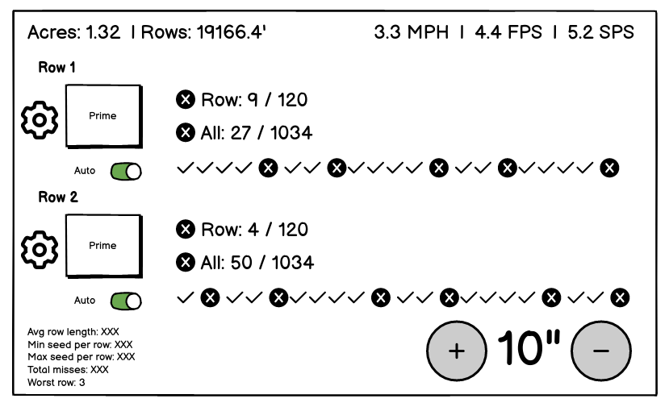

Potato Plant(er)
===

Harriston n-row potato planter driver based on raspberry pi.

## Platform
- Raspberry Pi
- Official Pi screen
- Adafruit DC motor hat

## Stack
- Iced GUI
- rppal pi gpio

## Physical IO

Inputs and outputs can be classified as being planter wide (one per planter) or per-row.

### Planter Inputs
- Planter raised/lowered sensor
- Pick wheel drive shaft sensor
- GPS speed

### Planter Outputs
- Pick wheel flow servo

### Row Inputs
- Hopper fill sensor
- Seed sensor eye

### Row Outputs
- Seed belt control

## Roadmap

1. - [ ] Seed belt control
2. - [ ] Pick wheel flow control
3. - [ ] Pick wheel speed sensor
4. - [ ] Planter raised sensor
5. - [ ] GPS speed sensor
6. - [ ] Hopper fill sensor
7. - [ ] Seed sensor eye
8. - [ ] Row context tracking based on planter raised sensor

## References
- 
